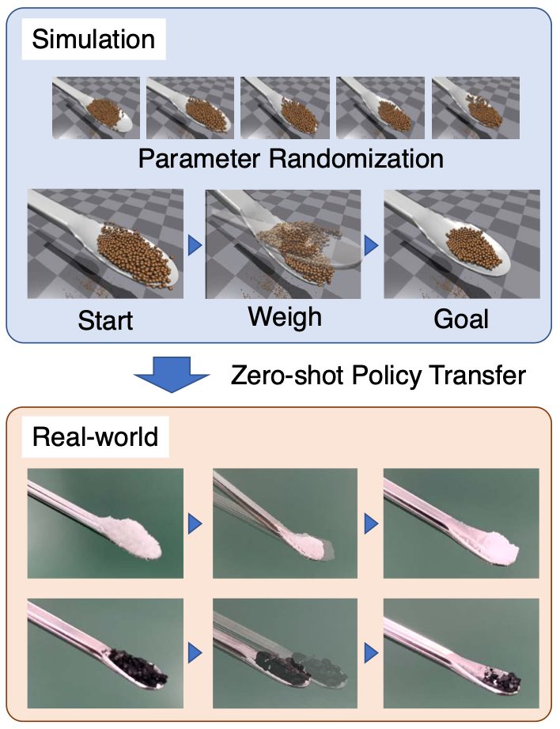

# robotic-powder-weighting



## Getting started

### To build environments
- [install pytorch](https://pytorch.org/get-started/locally/) (support 1.12.1)
- [install isaacgym](https://developer.nvidia.com/isaac-gym)
- [install ROS (for real-robot)](http://wiki.ros.org/ROS/Installation)

## Experiments

### check behavior of the powder weighing simulator
This code shows powder shaking actions.
You can control the environment by joystick controller.

```
cd simulation
python test_env_hellow.py --render
```

### test powder weighing
This code shows powder shaking actions.
You can control the environment by joystick controller.

```
cd simulation
python test_env_stick.py --render
```

### learning policies
This code shows how to run the learning policies.
Particularly, isaacgym have a memory-reek error.
So, in this experiments the environment is reset by subprocess.
```
cd simulation
python root_learning.py --flag 1111111111 --render
```
flag means what domain parameters are fixed on learning and action definitions.
1 means random or set, 0 means fixed or removed.
All parameters are bellow.
- incline_flag
- shake_flag
- ball_radius_flag
- ball_mass_flag
- ball_friction_flag
- ball_layer_num_flag
- spoon_friction_flag
- goal_powder_amount_flag
- shake_speed_weight_flag
- gravity_flag

render means learning with rendering the environment or not.

### test policies on real robot
1. build up ros packages in catkin_ws
2. set up weighing machine
   - connect data cable from PC to the machine.
   - check USB port name(ex: /dev/ttyUSB or COM2)
   - set Format to 5 of weighing machine
   - set unit to mg of weighing machine
   - sudo chmod a+rw /dev/ttyUSB0
3. run the robot with learned policies
```
cd real_robot/powder_task
python PowderEnvironmentController.py --test --dir ./policy_directly/Policy.pth
```